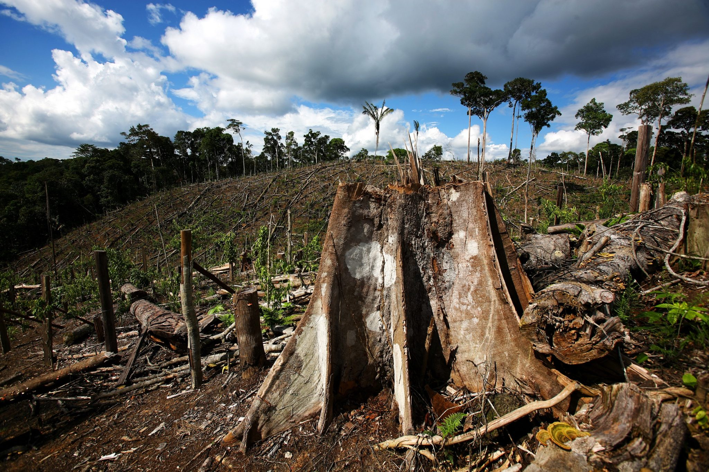
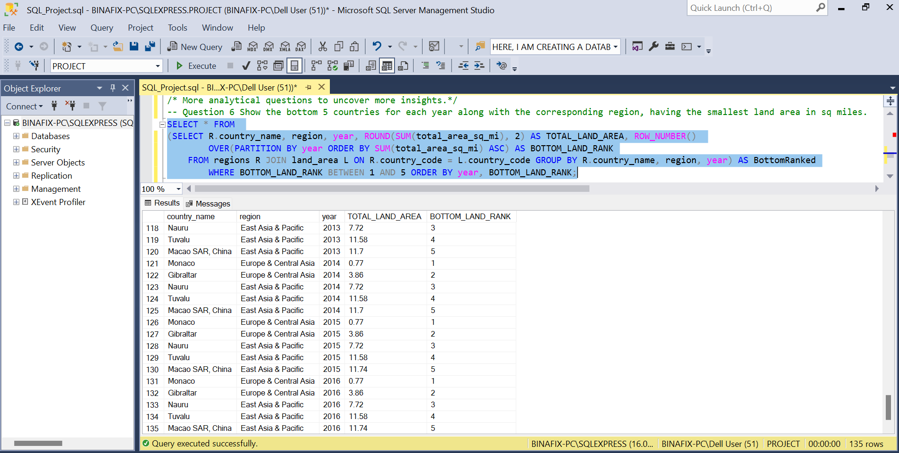
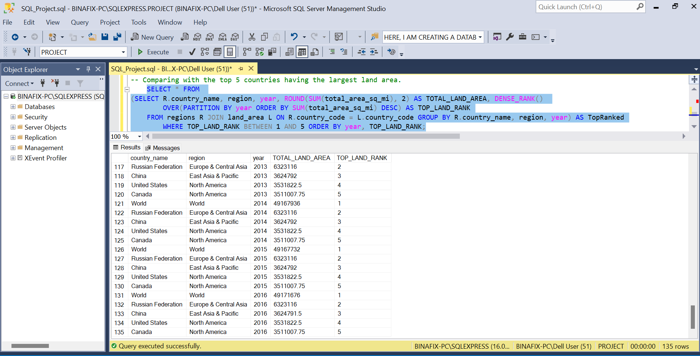
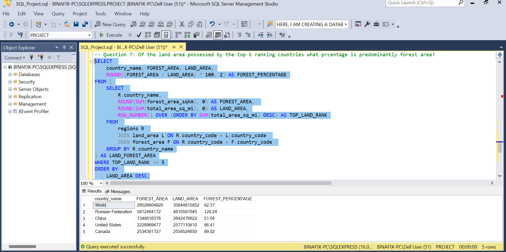

# Comprehensive Deforestation Analysis- Unveiling Environmental Trends and Insights using Advanced SQL Techniques

**Image Link**: https://www.srilankafoundation.org/wp-content/uploads/2016/09/Deforestation.jpg

## Introduction
In this impactful SQL project on deforestation, I employed advanced database querying techniques to analyze and interpret extensive datasets related to global deforestation trends. By leveraging SQL, I uncovered critical insights into the countries and regions involved in deforestation, income groups, land areas, forest areas, and geographical patterns, facilitating informed decision-making for sustainable forestry management and environmental conservation efforts.

_Disclaimer:_ The dataset used and reports generated do not represent any company, institution, or country. It is a dummy dataset used to showcase SQL skills.

## Project Task and Project Questions
The following tasks and questions are the expectations from this project:

Projcet Task               |    Project Questions
:-------------------------:|:---------------------------:
    |    

## Skills Demonstrated:
The following syntaxes and functions were demonstrated:

* CREATE and USE Database
* SELECT, FROM, WHERE
* UPDATE, ROUND, SET
* AVG, COUNT, DISTINCT COUNT
* IS NULL, !=, <>, BETWEEN, AND, DESC
* AS, JOIN, ON, HAVING
* ORDER BY, GROUP BY
* DENSE RANK, OVER, PARTITION BY
* CTEs e.g WITH, SUBQUERIES

## Data Wrangling Procedure:

1. ### CREATING MY DATABASE - I created my database and named it 'PROJECT' and ensured the database was selected.
_CODE:_  ✍️

    CREATE DATABASE PROJECT;
    USE PROJECT;

2. ### IMPORTING THE DATASET - The 3 different dataset namely "forest_area", "land_area", and "regions" were imported and selected to view the table layout, content, and identify any NULL values.
_CODE:_  ✍️

    SELECT * FROM forest_area;   
    SELECT * FROM land_area;
    SELECT * FROM regions;

3. ### UPDATING THE TABLE - The values in the columns "forest_area_sqkm" and "total_area_sq_mi" were rounded to 2 decimal places and the tables updated.
_CODE:_  ✍️

    UPDATE forest_area
    SET forest_area_sqkm = ROUND(forest_area_sqkm, 2);

    UPDATE land_area
    SET total_area_sq_mi = ROUND(total_area_sq_mi, 2);

    SELECT * FROM forest_area;
    SELECT * FROM land_area;

4. ### CHECKING FOR NULL VALUES - Checking for NULL values in the forest_area and land_area tables, specifically the numerical columns.
_CODE:_  ✍️

    SELECT  * FROM forest_area WHERE forest_area_sqkm IS NULL; 
    SELECT  * FROM land_area WHERE total_area_sq_mi IS NULL; 

5. ### REPLACING NULL VALUES - I calculated the average forest and land areas and used the average value to replace the NULL values in the columns. I checked the columns again to be sure this executed correctly.
_CODE:_  ✍️

    SELECT ROUND(AVG(forest_area_sqkm), 2) FROM forest_area;
    SELECT ROUND(AVG(total_area_sq_mi), 2) FROM land_area;
    
    UPDATE forest_area SET forest_area_sqkm = 391051.84 WHERE forest_area_sqkm IS NULL;
    UPDATE land_area SET total_area_sq_mi = 457095.35 WHERE total_area_sq_mi IS NULL;

    SELECT  * FROM forest_area WHERE forest_area_sqkm IS NULL; 
    SELECT  * FROM land_area WHERE total_area_sq_mi IS NULL; 

## Data Analysis and Insights generated 

### Question 1: What are the total number of countries involved in deforestation?
* This question can be answered in 2 ways
* I used the DISTINCT and COUNT operators
* A total number of 219 coutries are involved in the deforestaion
* 
_CODE:_  ✍️

      SELECT DISTINCT COUNT(country_name) FROM regions;
      SELECT DISTINCT country_name FROM regions;

### Question 2: Show the income groups of countries having total area ranging from 75,000 to 150,000 square meter?
* I used the JOIN, ON, AS, BETWEEN and AND operators here
* The income groups and total forest areas are in two different tables - "Regions" and "Forest_area" tables
* To answer this question, I joined the two tables together using a common key "country_name" column which is in both tables
* I also used aliasing (R and F) to make referencing easier

_CODE:_  ✍️

    SELECT country_name, income_group FROM regions R JOIN forest_area F ON R.country_name = F.country_name
    WHERE forest_area_sqkm BETWEEN 75000 AND 150000;

* The above syntax threw an "ambiguous column name" error because the column "country_name" appears in both tables with the exact same title which confuses the database engine. 
* To fix this, I had to qualify the the "country_name" column with the table name or Alias.

_CODE:_  ✍️

    SELECT R.country_name, income_group, forest_area_sqkm FROM regions R JOIN forest_area F ON R.country_name = F.country_name
    WHERE forest_area_sqkm BETWEEN 75000 AND 150000;

* I included the forest_area_sqkm column in the SELECT clause to crosscheck the result of the query.
* There are a total of 586 countries having a total forest area between 75,000 and 150,000 square meters.
* The income group of these countries range from high income, upper middle income, lower middle income and low income.

### Question 3: Calculate average area in square miles for countries in the 'upper middle income region'. Compare the result with the rest of the income categories.
* I used the ROUND, AVG, AS, JOIN, ON, GROUP BY, ORDER BY, HAVING, and != operators to answer this question.
* The income groups and total land areas are in two different tables - "Regions" and "land_area" tables
* To answer this question, I joined the two tables together using a common key "country_name" column which is in both tables
* I also used aliasing (R and L) to make referecing easier
* There are 55 countries in the upper middle income group spread across 6 regions

_CODE:_  ✍️

      SELECT R.country_name, income_group, ROUND(AVG(total_area_sq_mi), 2) AS AVG_AREA FROM regions R 
      JOIN land_area L on R.country_name = L.country_name
      GROUP BY R.country_name, region, income_group HAVING income_group = 'Upper middle income'
      ORDER BY AVG_AREA DESC;

* I compared the result to the other income groups by selecting income groups that are NOT in the 'upper middle income' category
* This second syntax returned 157 countries that are NOT in the upper middle income region.

_CODE:_  ✍️

      SELECT R.country_name, income_group, ROUND(AVG(total_area_sq_mi), 2) AS AVG_AREA FROM regions R 
      JOIN land_area L on R.country_name = L.country_name
      GROUP BY R.country_name, region, income_group HAVING income_group != 'Upper middle income'
      ORDER BY AVG_AREA DESC;

### Question 4: Determine the total forest area in square km for countries in the 'high income' group. Compare result with the rest of the income categories.
* I used the SUM, AS, JOIN, ON, DESC, GROUP BY, ORDER BY, HAVING, and <> operators to answer this question.
* The income groups and total forest areas are in two different tables - "Regions" and "Forest_area" tables
* To answer this question, I joined the two tables together using a common key "country_name" column which is in both tables
* I also used aliasing (R and F) to make referencing easier
* There are 80 countries in the high income group with varying range of forest areas

_CODE:_  ✍️

    SELECT F.country_name, income_group, SUM(forest_area_sqkm) AS TOTAL_AREA FROM forest_area F 
    JOIN regions R ON F.country_code = R.country_code 
    GROUP BY F.country_name, income_group HAVING income_group = 'High income' ORDER BY TOTAL_AREA DESC;

* I compared the result to the other income groups by selecting income groups that are NOT in the 'hig income' category
* This second syntax returned 138 countries that are NOT in the high income region.

_CODE:_  ✍️

    SELECT F.country_name, income_group, SUM(forest_area_sqkm) AS TOTAL_AREA FROM forest_area F 
    JOIN regions R ON F.country_code = R.country_code 
    GROUP BY F.country_name, income_group HAVING income_group <> 'High income' ORDER BY TOTAL_AREA DESC;

### Question 5: Show countries from each region(continent) having the highest total forest areas. 
* I used the ROUND, SUM, AS, JOIN, ON, DESC, GROUP BY, ORDER BY, DENSE_RANK, OVER, PARTITION BY, CTE - WITH operators to answer this question.
* The income groups and total forest areas are in two different tables - "Regions" and "Forest_area" tables
* To answer this question, I joined the two tables together using a common key "country_name" column which is in both tables
* I also used aliasing (R and F) to make referencing easier
* This can be tackled in two ways:
  
**_-- Using subqueries_**
_CODE:_  ✍️

    SELECT *
    FROM (
        SELECT R.country_name, region, ROUND(SUM(forest_area_sqkm), 2) AS TOTAL_FOREST_AREA, DENSE_RANK() 
        OVER(PARTITION BY region ORDER BY SUM(forest_area_sqkm) DESC) AS HIGHEST_FOREST_RANK 
        FROM regions R 
        JOIN forest_area F ON R.country_name = F.country_name 
        GROUP BY R.country_name, region
    ) RankedForests
    WHERE HIGHEST_FOREST_RANK = 1
    ORDER BY TOTAL_FOREST_AREA DESC;

**_-- Using commorn tabke expressions (CTE)_**
_CODE:_  ✍️

    WITH RankedForests AS 
    (
        SELECT R.country_name, region, ROUND(SUM(forest_area_sqkm), 2) AS TOTAL_FOREST_AREA, DENSE_RANK() 
        OVER(PARTITION BY region ORDER BY SUM(forest_area_sqkm) DESC) AS HIGHEST_FOREST_RANK
        FROM regions R JOIN forest_area F ON R.country_name = F.country_name GROUP BY R.country_name, region
    )
    SELECT *
    FROM RankedForests
    WHERE HIGHEST_FOREST_RANK = 1
    ORDER BY TOTAL_FOREST_AREA DESC;

* An ORDER BY clause was added at the outer query to sort the result in descending order of the total forest area.
* The above 2 queries returned the same result.
* There are 8 countries acrross 8 different regions
* We can notice the name "World" in both the country_name and region columns. This classification is unclear, however, it was retained.
* Clarifications on what this represents and if it is important in the analysis should be made from the database engineer.

##  More analytical questions to uncover more insights.

### Question 6: Show the bottom 5 countries for each year along with the corresponding region, having the smallest land area in sq miles.
* I used the ROUND, SUM, AS, JOIN, ON, DESC, GROUP BY, ORDER BY, ROW_NUMBER, OVER, PARTITION BY, BETWEEN, AND operators to answer this question.
* We can see that the countries ranking at the bottom are consistent every year.
* The bottom 5 countries having the smallest land area are Monaco, Gilbraltar, Nauru, Tuvalu, Macoa SAR China with Monaco having the least land area of 0.77sqmi

_CODE:_  ✍️

    SELECT * FROM 
    (SELECT R.country_name, region, year, ROUND(SUM(total_area_sq_mi), 2) AS TOTAL_LAND_AREA, ROW_NUMBER() 
    		OVER(PARTITION BY year ORDER BY SUM(total_area_sq_mi) ASC) AS BOTTOM_LAND_RANK
        FROM regions R JOIN land_area L ON R.country_code = L.country_code GROUP BY R.country_name, region, year) AS BottomRanked
    		WHERE BOTTOM_LAND_RANK BETWEEN 1 AND 5 ORDER BY year, BOTTOM_LAND_RANK;

* Comparing with the top 5 countries having the largest land area.
* Here too, the countries ranking at the top are consistent every year.
* The top 5 countries having the largest land area are World, Russian Fedearion, China, United States and Canada.
* "World" consitently topped the list having a larger land area than other countries.

_CODE:_  ✍️

    	SELECT * FROM 
    (SELECT R.country_name, region, year, ROUND(SUM(total_area_sq_mi), 2) AS TOTAL_LAND_AREA, DENSE_RANK() 
    		OVER(PARTITION BY year ORDER BY SUM(total_area_sq_mi) DESC) AS TOP_LAND_RANK
        FROM regions R JOIN land_area L ON R.country_code = L.country_code GROUP BY R.country_name, region, year) AS TopRanked
    		WHERE TOP_LAND_RANK BETWEEN 1 AND 5 ORDER BY year, TOP_LAND_RANK;

### Question 7: Of the land area possessed by the top 5 ranking countries what prcentage is predominantly forest area?
* The percentage of land areas that is dominated by forest was ccalculated.
* It was observed that for the country Russian Federation, we had 128.24% (which appears implausible).
* This provokes the question: Is the "land area" in this dataset representative of the total land area that each country has?  

_CODE:_  ✍️

    SELECT 
        country_name, FOREST_AREA, LAND_AREA,
        ROUND((FOREST_AREA / LAND_AREA) * 100, 2) AS FOREST_PERCENTAGE
    FROM (
        SELECT 
            R.country_name, 
            ROUND(SUM(forest_area_sqkm), 0) AS FOREST_AREA, 
            ROUND(SUM(total_area_sq_mi), 0) AS LAND_AREA,
            ROW_NUMBER() OVER (ORDER BY SUM(total_area_sq_mi) DESC) AS TOP_LAND_RANK
        FROM 
            regions R 
            JOIN land_area L ON R.country_code = L.country_code 
            JOIN forest_area F ON R.country_code = F.country_code 
        GROUP BY R.country_name
    ) AS LAND_FOREST_AREA
    WHERE TOP_LAND_RANK <= 5
    ORDER BY 
        LAND_AREA DESC;

### Question 8: What are the top 10 countries with the largest forest areas?
* The top 10 countries having the largest forest areas are World, Russian Fedearion, Brazil, Canada, United States, China, Congo Dem. Rep., Australia, Indonesia, and Peru.
* "World" ranks top on the list of countries with the largest forest area.

_CODE:_  ✍️

    SELECT *
    FROM (
        SELECT TOP 10
            R.country_name, 
            ROUND(SUM(forest_area_sqkm), 2) AS TOTAL_FOREST_AREA, 
            ROW_NUMBER() OVER (ORDER BY SUM(forest_area_sqkm) DESC) AS TOP_FOREST_RANK
        FROM regions R 
        JOIN forest_area F ON R.country_code = F.country_code 
        GROUP BY R.country_name
    ) AS TopRanked
    WHERE TOP_FOREST_RANK BETWEEN 1 AND 10
    ORDER BY TOP_FOREST_RANK, TOTAL_FOREST_AREA DESC;

## Conclusion:

* With the analysis carried out, I was able to answer key questions that could provide insights into possible deforestaion projects.
* Some countries possess a large land and forest area while others have very little. If we intend to clear the forest areas to make more room for land for infrastructural purposes, this insight can help create the right perspective and direction.
* It could be observed that the land area stayed consistent across all years.
*  With World, Russian Fedearion, Brazil, Canada, and United States having large forest areas, expansions for buildings and infrasstruture can be considered.
*  Monaco has the least land area of all the countries, 0.77sqmi.
*  The coutries and regions represented cut accross various income groups and we can dig deeper to identify and relationship between the country's income group and their land/forest mass if any.

Thank you! 😃
